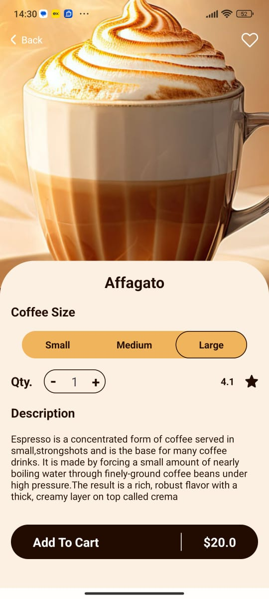
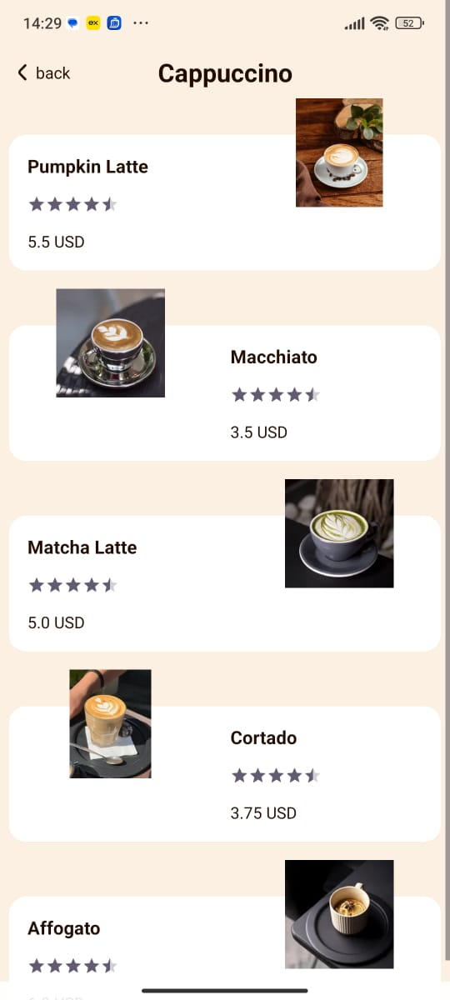
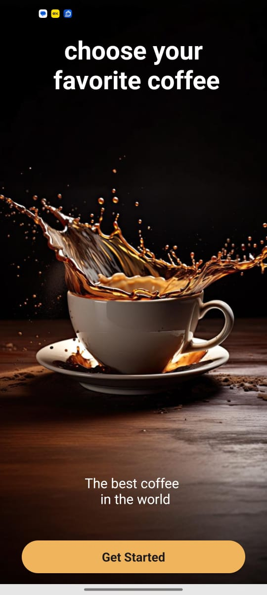
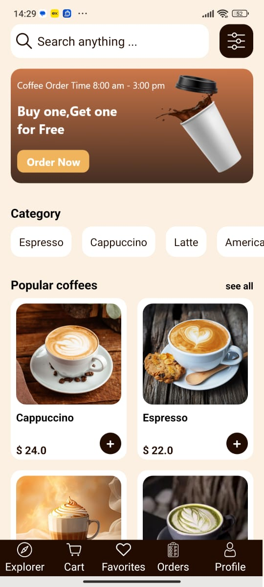

# ☕ Qahva

A full-featured e-commerce coffee shop application built with **Kotlin** and **MVVM architecture**. Users can browse products by category, view details, adjust quantities, and manage their shopping cart with real-time price updates. Data is powered by **Firebase Realtime Database**.

---

  
  
  
  

## 🔑 Key Features

- 🔍 Product browsing by category
- 🛒 Detailed product views with size/quantity selection
- 💰 Real-time price calculation and cart updates
- 📦 Cart management using custom logic
- 🖼 Seamless image loading with Glide
- 🔄 Dynamic UI with RecyclerViews
- 🔧 Lifecycle-aware updates using LiveData and ViewModel
- 🔥 Firebase Realtime Database for backend data

---

## 🧱 Architecture

This app follows the **MVVM (Model-View-ViewModel)** architecture with:

- **Repository Pattern** for clean data access
- **ViewModel** to manage UI-related data in a lifecycle-conscious way
- **LiveData** to observe data changes and update the UI reactively
- **ViewBinding** for type-safe access to views

---

## 🧰 Tech Stack

| Category              | Tools & Libraries                             |
|----------------------|-----------------------------------------------|
| Language             | Kotlin                                        |
| Architecture         | MVVM, Repository Pattern                      |
| UI Components        | RecyclerView, Toast, ProgressBar              |
| Android Jetpack      | LiveData, ViewModel, ViewBinding              |
| Image Loading        | Glide                                         |
| Backend              | Firebase Realtime Database                    |
| IDE & Build System   | Android Studio, Gradle                        |

---

## 📂 Project Structure
com.example.ecommerceapp
- **adapters/ # RecyclerView adapters
- **data/ # Firebase models and cart manager
- **repository/ # Data handling logic
- **activities/ # Main, Detail, Cart activities
- **fragments/ # Reusable UI sections
- **viewmodel/ # ViewModels for business logic
